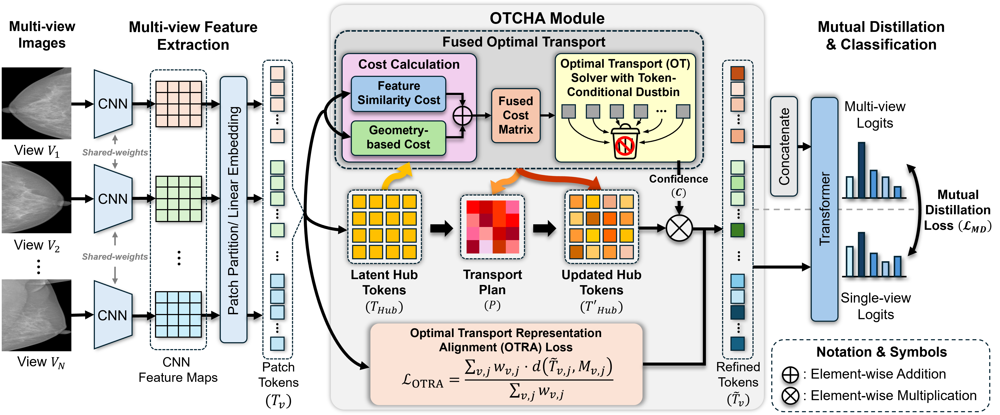

# OTCHA: Optimal Transport-driven Confidence-aware Latent Hub Alignment for Multi-View Medical Image Classification

Official PyTorch implementation of **OTCHA: Optimal Transport-driven Confidence-aware Latent Hub Alignment**.

**Paper:** Coming Soon
**Authors:** [Jiwoong Yang](https://scholar.google.com/citations?user=rrsgcvcAAAAJ&hl=ko), [Haejun Chung](https://scholar.google.com/citations?user=O-oZnIwAAAAJ&hl=ko), and [Ikbeom Jang](https://scholar.google.com/citations?user=1rBh9xkAAAAJ&hl=ko)  
**Conference:** *MICCAI*

  

  <b>Figure 1.</b> Overview of the proposed OTCHA framework.

## Abstract

Multi-view imaging, such as mammography and chest radiography, is a standard component of clinical practice. However, medical images are often unregistered and contain view-specific artifacts or irrelevant background cues that can obscure diagnostically relevant findings. Many existing methods directly fuse per-view representations, allowing such irrelevant content to contaminate the fused embedding and reducing robustness under varying view configurations.
We propose **OTCHA**, a confidence-aware latent hub token alignment module based on optimal transport (OT) that refines patch tokens before fusion for multi-view classification. OTCHA introduces a set of learnable latent hub tokens shared across views.
For each view, we compute an OT plan between patch tokens and hub tokens that jointly considers feature similarity and geometry, and augment the OT formulation with token-conditional dustbins to enable partial matching and discard irrelevant tokens. The resulting transport plan provides token-wise matching confidence, which gates hub-mediated message passing and weights a novel optimal-transport-based representation alignment loss to stabilize refinement. 
Experiments on three multi-view medical image datasets demonstrate consistent improvements over competing baselines across diverse anatomies and view configurations.

## License

This project is released under the MIT License.
